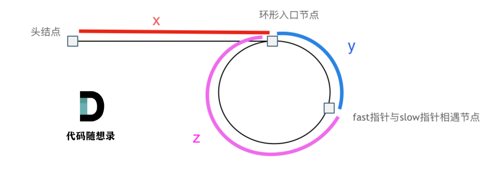

# 142. 环形链表 II

[题目链接](https://leetcode.cn/problems/linked-list-cycle-ii/)

给定一个链表，返回链表开始入环的第一个节点。 如果链表无环，则返回 `null`。

为了表示给定链表中的环，我们使用整数 `pos` 来表示链表尾连接到链表中的位置（索引从 0 开始）。 如果 `pos` 是 `-1`，则在该链表中没有环。**注意，`pos` 仅仅是用于标识环的情况，并不会作为参数传递到函数中。**

**说明：**不允许修改给定的链表。

**进阶：**

- 你是否可以使用 `O(1)` 空间解决此题？

 

**示例 1：**


```
输入：head = [3,2,0,-4], pos = 1
输出：返回索引为 1 的链表节点
解释：链表中有一个环，其尾部连接到第二个节点。
```

**示例 2：**


```
输入：head = [1,2], pos = 0
输出：返回索引为 0 的链表节点
解释：链表中有一个环，其尾部连接到第一个节点。
```

**示例 3：**


```
输入：head = [1], pos = -1
输出：返回 null
解释：链表中没有环。 
```

**提示：**

- 链表中节点的数目范围在范围 `[0, 104]` 内
- `-105 <= Node.val <= 105`
- `pos` 的值为 `-1` 或者链表中的一个有效索引

## 解法

**快慢指针**

假设从头结点到环形入口节点 的节点数为`x`。 环形入口节点到 `fast` 指针与 `slow` 指针相遇节点 节点数为 `y`。 从相遇节点 再到环形入口节点节点数为 `z`。 如图所示：



那么相遇时： `slow` 指针走过的节点数为: `x + y`， `fast` 指针走过的节点数：`x + y + n (y + z)`，`n` 为 `fast` 指针在环内走了 `n` 圈才遇到 `slow` 指针， `(y + z)`为 一圈内节点的个数 `A`。

因为 `fast` 指针是一步走两个节点，`slow` 指针一步走一个节点， 所以 `fast` 指针走过的节点数 `= slow` 指针走过的节点数 `* 2`，即：

```
(x + y) * 2 = x + y + n (y + z)
```

两边减去 `(x + y)` 得: `x + y = n (y + z)`

因为要找环形的入口，那么要求的是 `x`，因为 `x` 表示 头结点到环形入口节点的的距离。

所以要求 `x` ，将 `x` 单独放在左面：`x = n (y + z) - y` ,

再从 `n(y + z)` 中提出一个 `(y + z)` 来，整理公式之后为如下公式：`x = (n - 1) (y + z) + z` 注意这里 `n` 一定是大于等于 1 的，因为 `fast` 指针至少要多走一圈才能相遇 `slow` 指针。

这个公式说明什么呢？

先拿 `n` 为 `1` 的情况来举例，意味着 `fast` 指针在环形里转了一圈之后，就遇到了 `slow` 指针了。

当 `n` 为 `1` 的时候，公式就化解为 `x = z`，

这就意味着，**从头结点出发一个指针，从相遇节点 也出发一个指针，这两个指针每次只走一个节点， 那么当这两个指针相遇的时候就是环形入口的节点**。

也就是在相遇节点处，定义一个指针 `index1`，在头结点处定一个指针 `index2`。

让 `index1` 和 `index2` 同时移动，每次移动一个节点， 那么他们相遇的地方就是环形入口的节点。


```java
public class Solution {
    public ListNode detectCycle(ListNode head) {
        if (head == null || head.next == null) {
            return null;
        }
        ListNode fast = head, slow = head;
        // 直到快指针走到终点或者与慢指针相交
        while (fast != null && fast.next != null) {
            fast = fast.next.next;
            slow = slow.next;
            if (fast == slow) {
                break;
            }
        }
        // 无环
        if (fast == null || fast.next == null) {
            return null;
        }
        // 有环。另一个指针从头节点开始和慢指针一起移动，相交的位置即为入环的第一个节点。
        ListNode tmp = head;
        while (tmp != slow) {
            tmp = tmp.next;
            slow = slow.next;
        }
        return tmp;
    }
}
```

