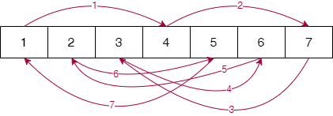

# 189. 轮转数组

[题目链接](https://leetcode.cn/problems/rotate-array/)

给定一个整数数组 `nums`，将数组中的元素向右轮转 `k` 个位置，其中 `k` 是非负数。

**示例 1:**

```
输入: nums = [1,2,3,4,5,6,7], k = 3
输出: [5,6,7,1,2,3,4]
解释:
向右轮转 1 步: [7,1,2,3,4,5,6]
向右轮转 2 步: [6,7,1,2,3,4,5]
向右轮转 3 步: [5,6,7,1,2,3,4]
```

**示例 2:**

```
输入：nums = [-1,-100,3,99], k = 2
输出：[3,99,-1,-100]
解释: 
向右轮转 1 步: [99,-1,-100,3]
向右轮转 2 步: [3,99,-1,-100]
```

**提示：**

- `1 <= nums.length <= 10^5`
- `-2^31 <= nums[i] <= 2^31 - 1`
- `0 <= k <= 10^5`

**进阶：**

- 尽可能想出更多的解决方案，至少有 **三种** 不同的方法可以解决这个问题。
- 你可以使用空间复杂度为 `O(1)` 的 **原地** 算法解决这个问题吗？

## 解法

从后往前两个元素交换位置，可以将末尾元素移动至头部。由于 `nums.length` 最大可以为 $$10^5$$，所以这种方法肯定会超时。所以要尽量减少遍历和交换的次数。

### 1. 使用额外数组

用 `n` 表示数组的长度，我们遍历原数组，将原数组下标为 `i` 的元素放至新数组下标为 $$(i+k)\bmod n$$ 的位置，最后将新数组拷贝至原数组即可。

```java
class Solution {
    public void rotate(int[] nums, int k) {
        int n = nums.length;
        int[] tmp = new int[n];
        for (int i = 0; i < n; i++) {
            tmp[(i + k) % n] = nums[i];
        }
        System.arraycopy(tmp, 0, nums, 0, n);
    }
}
```

### 2. 数组翻转

当我们将数组的元素向右移动 `k` 次后，由于 `k` 可能大于数组长度，尾部 $$k\bmod n$$ 个元素会移动至数组头部，其余元素向后移动 $$k\bmod n$$ 个位置。

先整体翻转，再翻转前 $$k\bmod n$$ 位元素，再翻转后 $$n - k\bmod n$$ 位元素即可。

这样每个元素被反转 2 次，时间复杂度为 $O(n)$。

```java
class Solution {
    public void rotate(int[] nums, int k) {
        k %= nums.length;
        reverse(nums, 0, nums.length - 1);
        reverse(nums, 0, k - 1);
        reverse(nums, k, nums.length - 1);
    }

    public void reverse(int[] nums, int start, int end) {
        while (start < end) {
            nums[start] ^= nums[end];
            nums[end] ^= nums[start];
            nums[start] ^= nums[end];
            start++;
            end--;
        }
    }
}
```

### 3. 环状交换

在方法 1 中，我们可以知道每个元素的最终位置，那么直接将元素与对应位置元素位置交换可以吗？

那么先直接遍历一遍进行交换试试，以数组 `nums = [1,2,3,4,5,6,7], k = 3` 为例，交换过程为：

```java
swap(nums[0], nums[3]);
swap(nums[1], nums[4]);
swap(nums[2], nums[5]);
swap(nums[3], nums[6]); // 但是 nums[3] 之前已经和 nums[0] 交换过，此时这样交换会出问题
...
```

如果使用上面的方法就会发现当走到 `nums[3]` 时，再将其与 `nums[6]` 交换是不对的，应该将 `nums[0]` 与 `nums[6]` 交换。

所以如果使用顺序遍历交换肯定是不行的。应该每次交换后将被交换的数字放至它最后的位置。比如：

```
swap(nums[0], nums[3]); // 将nums[0] 放置到 nums[3]
swap(nums[3], nums[6]); // 将nums[3] 放置到 nums[6]
swap(nums[6], nums[2]); // 将nums[6] 放置到 nums[2]
swap(nums[2], nums[5]); // 将nums[2] 放置到 nums[5]
...
```

整体流程如下图：



**那么什么时候交换结束呢？**

循环是从 `nums[0]` 开始的，最后指针是否回到 `nums[0]`，一遍循环否可行呢？

答案是是不可行的，如下：`nums = [1, 2, 3, 4, 5, 6], k = 2`。

仅遍历一遍有些数字可能还没有遍历到，第一次循环：$$1 \rightarrow 3 \rightarrow 5 \rightarrow 1$$，第二次循环：$$2 \rightarrow 4 \rightarrow 6 \rightarrow 2$$。

所以当指针回到 `nums[0]` 后应该从下一位 `nums[1]` 继续开始下一轮循环。


设数组长度为 $$n$$，总共交换 $$n$$ 次，问题是应该遍历几次，每次遍历几个。

观察上面的过程：第一次循环：$$1 \rightarrow 3 \rightarrow 5 \rightarrow 1$$，第二次循环：$$2 \rightarrow 4 \rightarrow 6 \rightarrow 2$$，可以发现每次小循环回到循环开始的位置即代表当前循环结束，所以可以通过是否回到循环起点终止一次小循环。

```java
class Solution {
    public void rotate(int[] nums, int k) {
        int count = 0;
        int len = nums.length;
        for (int i = 0; i < nums.length && count < len; i++) {
            int j = i;
            int tarPos = (j + k) % len;
            int pre = nums[j];
            // 如果 tarPos = i 表示待交换元素位置为循环起始位置
            while (count < len && tarPos != i) {
                int cur = nums[tarPos];
                nums[tarPos] = pre;
                j = tarPos;
                tarPos = (j + k) % len;
                count++;
                pre = cur;
            }
            // 此时起始位置元素还背替换，还需要再替换一次
            nums[tarPos] = pre;
            count++;
        }
    }
}
```

### 4. 裴蜀定理

由**裴蜀定理**可知：

- 当 $$gcd(n,k)=1$$ 时，一直轮转下去可以遍历一整遍数组，当遍历次数到达 n 次需要退出。 
- 当 $$g=gcd(n,k)>1$$ 时，从某一个位置开始轮转一定会出现循环。那么一次循环的次数是 $$cnt=n/g$$，并且需要从 $$[0,g−1]$$ 分别开始循环，共循环 $$g$$ 次，每次循环 $$n/g$$ 个变量。

