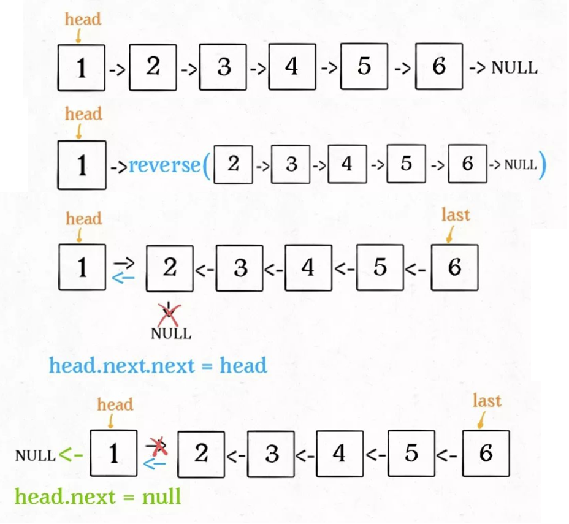

# 206. 反转链表

[题目链接](https://leetcode.cn/problems/reverse-linked-list/)

给你单链表的头节点 `head` ，请你反转链表，并返回反转后的链表。

**示例 1：**


```
输入：head = [1,2,3,4,5]
输出：[5,4,3,2,1]
```

**示例 2：**


```
输入：head = [1,2]
输出：[2,1]
```

**示例 3：**

```
输入：head = []
输出：[]
```

 

**提示：**

- 链表中节点的数目范围是 `[0, 5000]`
- `-5000 <= Node.val <= 5000`

 

**进阶：**链表可以选用迭代或递归方式完成反转。你能否用两种方法解决这道题？

## 思路

遍历把每个节点的指向下一个节点的指针指向前一个节点即可。


## 迭代

遍历把每个节点的指针指向其前置节点即可。

```java
public ListNode reverseList(ListNode head) {
    if(head == null || head.next == null){
        return head;
    }
	ListNode pre = null;
    ListNode next;
    while (head != null) {
        next = head.next;
        head.next = pre;
        pre = head;
        head = next;
    }
    return pre;
}
```

## 递归

把反转的局部当做一个整体，原来的尾结点成为新的头结点返回，原来的头结点成为新的尾结点。



```java
public ListNode reverseList(ListNode head) {
    if(head == null || head.next == null){
        return head;
    }
    
    // 递归调用，翻转第二个节点开始往后的链表
    ListNode last = reverseList(head.next);
    // 翻转头节点与第二个节点的指向
    head.next.next = head;
    // 此时的 head 节点为尾节点，next 需要指向 NULL
    head.next = null;
    return last;
}
```


