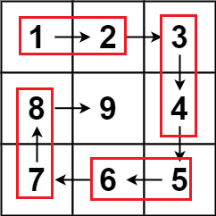

# 59. 螺旋矩阵 II

[题目链接](https://leetcode.cn/problems/spiral-matrix-ii/)

给你一个正整数 `n` ，生成一个包含 `1` 到 $n^2$ 所有元素，且元素按顺时针顺序螺旋排列的 `n x n` 正方形矩阵 `matrix` 。

**示例 1：**


```
输入：n = 3
输出：[[1,2,3],[8,9,4],[7,6,5]]
```

**示例 2：**

```
输入：n = 1
输出：[[1]]
```

**提示：**

- `1 <= n <= 20`

## 思路

循环从外圈到内圈依次打印即可。如下图，左开右闭打印比较方便，如果用 `circle` 表示从外到内第几圈，那么可以利用 `circle` 和 `n - circle` 表示当前打印的边界，例如：当 `n = 3` 时，最外圈的上边边界为 `[0, 0]` 到 `[0, 1]`，右边的边界为 `[0, 2]` 到 `[1, 2]`。通用表示为：上边左右边界为 `[circle - 1, circle - 1]` 到 `[circle - 1, n - circle - 1]`，右边的上下边界为 `[circle - 1, n - circle]` 到 `[n - circle - 1, n - circle]`。



```java
public int[][] generateMatrix(int n) {
    int[][] matrix = new int[n][n];
    int index = 1;
    int i = 0;
    int j = 0;
    // 第几圈
    int circle = 1;
    // 注意这里循环条件若为 circle < n， n 为奇数时最后一个元素会多导致转一圈，i 和 j 不一定会指向中心位置，此时 circle 应当小于 n - 1
    while(index < n * n){
        // 向右
        while(j <  n - circle){
            matrix[i][j++] = index++;
        }
        // 向下
        while(i <  n - circle){
            matrix[i++][j] = index++;
        }
        // 向左
        while(j >= circle){
            matrix[i][j--] = index++;
        }
        // 向上
        while(i >= circle){
            matrix[i--][j] = index++;
        }
        // 向内缩一圈
        i++;
        j++;
        // 圈数加1
        circle++;
    }
    // n 为奇数中心点赋值
    if(n % 2 != 0){
        matrix[i][j] = index++;
    }
    return matrix;
}
```

