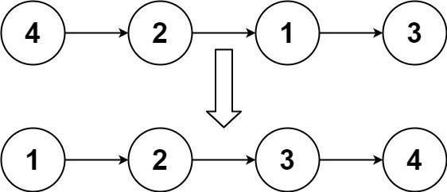
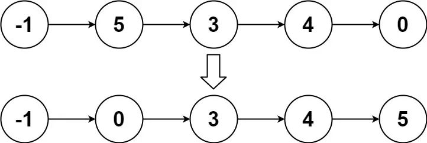

# [链表排序](https://www.cxyxiaowu.com/21846.html)

## 题目

给你链表的头结点 `head` ，请将其按 **升序** 排列并返回 **排序后的链表** 。

**示例 1：**



```
输入：head = [4,2,1,3]
输出：[1,2,3,4]
```

**示例 2：**



```
输入：head = [-1,5,3,4,0]
输出：[-1,0,3,4,5]
```

**示例 3：**

```
输入：head = []
输出：[] 
```

## 解法
